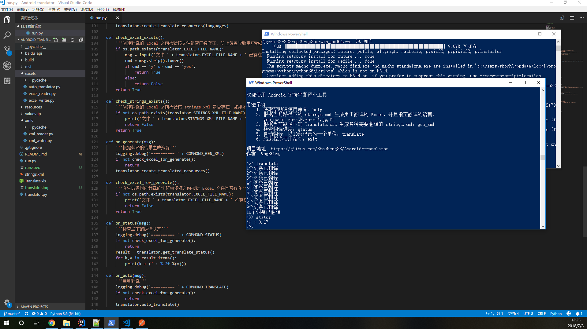

# Android-translator

> 该项目使用Python语言进行编写，用来根据指定的strings.xml文件自动生成用于多语言翻译的Excel表格，
> 以便提供给专门人员进行多语言翻译。在翻译之后可以根据Excel的内容自动生成各个语言对应的strings.xml文件。

## 1、项目结构



```
\----
    \----xml_reader.py     从XML中读取字符串资源 
    \----xml_writer.py     将翻译的结果写入到XML文件中
    \----excel_reader.py   从Excel中读取翻译的结果
    \----excel_writer.py   将XML中解析出的内容写入到Excel文件中
    \----translator.py     封装的翻译帮助模块
    \----run.py            命令行窗口、校验等
```

## 2、目前的功能


- 从XML中读取字符串资源，写入到Excel表格中；
- 将翻译的结果从Excel中读取并创建可用的xml字符资源文件；
- 获取所有语言当前的翻译状态；
- 记录程序中的日志到文件当中。

## 3、未来去做

- [ ] 使用三方的API直接对内容进行翻译
- [ ] 一键式生成所有语言的翻译
- [ ] 根据传入的参数选择指定的语言用于生成翻译后的字符串资源

## 4、参考内容

### 4.1 Excel的读写

安装Excel读写模块：

    pip install xlwt
    pip install xlrd
	
使用Excel读写模块：

	import xlwt
	import xlrd

### 4.2 xml解析
	
xml解析文章参考：[python-xml](http://www.runoob.com/python/python-xml.html)

### 4.3 Python打包成exe

首先，将Python打包成exe文件：

    pip install pyinstaller 

然后，在项目的根目录下面执行：

    pyinstaller -F run.py
	
最终生成的exe文件在dist目录下面

### 4.4 Python日志
	
在Python中使用日志：[Python 日志](https://www.cnblogs.com/nancyzhu/p/8551506.html)


	