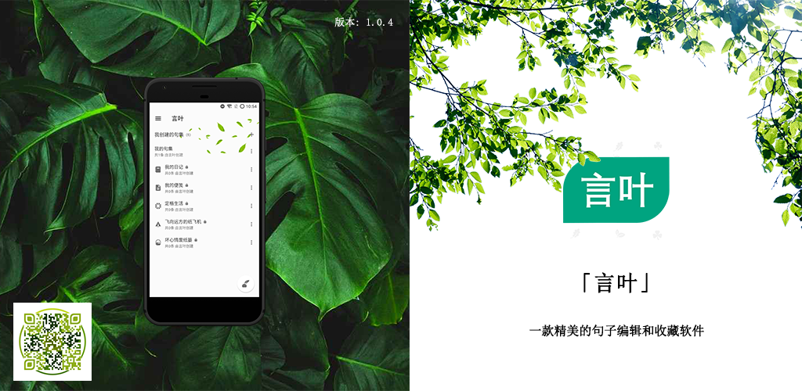

# TranslateMyApp：开源、多平台（Android+iOS）多语言管理工具

## 1、项目背景

TranslateMyApp 项目前身是我之前为了在 Android 应用中集成多语言而开发的一个工具，当时主要为了解决应用的词条的多语言翻译问题，即通过调用翻译 API 来减少应用翻译的工作量，然后将翻译结果自动转换为 Android 的多语言词条。然而实际应用的时候发现其存在诸多的不便之处，比如只能使用命令行进行管理，而我的命令行指令处理得比较粗糙，我自个儿用了都嫌麻烦。最近当我开发 [言叶APP](https://play.google.com/store/apps/details?id=me.shouheng.beauty) 的时候，为了降低多语言资源维护的难度，重新开发了这个应用，现在它具备了更多功能和特性，可以满足更多的应用场景（不只 Android，现在可以同时应用于 iOS）。

该项目完全使用 Python 开发，项目地址：https://github.com/Shouheng88/TranslateMyApp.

## 2、功能特性

### 2.1 跨平台的 GUI，支持 Mac 和 Windows 运行

考虑到很多用户（比如产品经理们）可能并并没有编程经验，更不会在日常的工作中使用命令行，因此我特地加入了 GUI 操作。在新的版本中，我使用了 Python 的 tkinter 标准 GUI 库来实现用户界面，并且在 Mac 和 Windows 上面测试并运行了程序。所以，TranslateMyApp 可以运行在 Mac 和 Windows 两个环境之上。


### 2.2 构建多语言仓库，承担多语言维护的责任

在新版本的应用中我们关注的不再是简单的导入和导出操作而是完整地维护你的整个多语言词库。在新的版本中，我们使用 json 文件，按照固定的格式将你的多语言词条储存到本地文件中。你通过 GUI 完成的任何操作都会直接同步到该 json 文件中。增加这个功能是考虑到我们实际开发过程中的多语言文件通常被放置在不同的文件夹下面，维护起来非常不方便。使用该工具之后，你可以通过导出和导入 Excel 来直接在 Excel 中翻译，或者直接将多语言资源的修改同步到应用的仓库中。

综上，在新版本中，新的应用肩负起维护你的整个多语言词条仓库的责任。通常，我们建议你 fork 我们的项目然后直接在你 fork 之后的项目中通过 Git 或者其它方式来维护自己的多语言仓库。我们随后会介绍最佳实践。

### 2.3 优化多语言自动化翻译功能

在之前的版本中，我们已经接入了 Baidu 的文字翻译 API 来辅助翻译，然而之前的项目存在一些美中不足之处：

1. 支持的翻译语种有限：这是因为移动端与百度翻译平台的语种名称不一致，需要手动维护一个映射关系，之前的版本中我只维护了部分语种。
2. 同一语种会被多次翻译：比如台湾繁体和香港繁体在 Android 上是两个语种资源，此时按照之前的逻辑会翻译两边，这样会减慢翻译速度，并且会浪费你的免费词条。
3. 翻译进度通过命令展示用户体验差：新的版本中，我们使用了一个单独的线程来完成翻译任务，并且在 GUI 界面上可以显示出当前翻译的进度，这大大提升了程序的用户体验。

在新的版本中，我们在之前的基础之上解决了上述问题，使得该应用的功能更加强大。

## 3、最佳实践

我们推荐你通过 fork 我们的项目，然后将应用内的多语言词条同步到该应用，并使用该软件管理你的多语言词条。这样不仅可以减轻翻译时的工作量，同时使用 Git 等多版本控制之后还可以实现多用户之间的协作。所以，最佳实践步骤如下：

1. 在 Github 或者 Gitee 上面 Fork 该项目作为自己的多语言资源仓库；

2. 准备环境。运行该 Python 程序需要做如下配置：

    1. 安装 Python3 环境；
    2. 安装 Excel 读写库，以及准备 Tkinter 环境；

    ```
    pip install xlwt
    pip install xlrd
    pip install xlutils
    ```

3. 然后在项目的根目录下面执行 `python launcher.py` 启动程序。该程序目前包含两个 GUI 页面，一个用来做项目初始化，另一个是主界面。如果项目没有被初始化，那么你首先将进入初始化页面，该页面如下。

    

    这里你需要先选择 Android 或者 iOS 的多语言**根目录**，并勾选想要维护的多语言。当你点击了“初始化”之后，软件会根据你指定的根目录和多语言进行合并处理，生产一个多语言仓库（所有的多语言资源被维护在 `config/repo.json` 文件中）。

4. 上述操作完毕之后关闭提示对话框，然后再次使用 `python launcher.py` 启动项目。此时将进入应用的主界面，如下图所示。

    

    这里总结分成 5 个功能点，其功能详情分别如下：

    1. **更新词条**：通常，我们的 APP 项目下会维护数个多语言资源，但当我们增、删、改词条的时候只在某个文件下面修改即可。当一个版本开发完毕之后，我们可以使用该功能更新多语言仓库。此时，TranslateMyApp 会自动将你的修改同步到仓库中。然后，你可以使用自助翻译或者导入、导出 Excel 等方式来实现其他多语言词条的翻译。

    2. **自助翻译**：使用自助翻译之前，你需要先到项目的 config 目录下面的 `baidu.json` 文件中填写你在 [百度翻译平台](https://fanyi-api.baidu.com/) 申请的 `app_id` 和 `app_secret`。自助翻译功能会自动为你增、删、改的多语言词条，并会在 GUI 界面上展示翻译的进度。

    3. **人工翻译**：人工翻译功能会以 Excel 的方式导出你的多语言仓库。导出的 Excel 表格中的空白的部分即为需要翻译的词条，你可以先使用 `导出` 功能导出 Excel，然后翻译之后再使用 `导入` 功能将翻译的结果同步到多语言仓库。

    4. **生成资源**：即将多语言仓库中的词条生成 Android 和 iOS 的多语言资源文件。当你的词条开发完毕之后可以使用该功能以**覆盖原文件**的形式生成最终的词条文件。

    5. **校验资源**：校验资源也是用来将 Android 和 iOS 的多语言资源修改同步到仓库的。它跟 `更新词条` 功能的区别在于：以 Android 为例，假如你在 `values-ja` 下面修改了词条 A，按照 `更新词条` 的处理方式，它会把 A 的其他语种的翻译记录清空，因为这表明经过一个版本的迭代之后改词条的含义发生了变化。而校验资源只会修改 values-ja 对应的语种的翻译记录，也就是该功能主要用来将你在 APP 项目中的词条修改同步到仓库使用（比如，用来修改机器翻译过程中导致的格式等错误）。

    6. 理想的​执行链应该是这样：APP 项目内修改多语言词条 -> 更新修改到多语言仓库 (步骤 1)   -> 自动翻译或者导出 Excel 翻译之后再导入 (步骤 2 3)  -> 生成 APP 内的多语言资源 (步骤 4) -> 如果某个多语言词条存在问题，修改，然后修改之后的结果同步到仓库 (步骤 5)。​

## 4、项目结构

```
|--config
|   |--app.json         应用配置
|   |--baidu.json       百度翻译配置
|   |--languages.json   项目的多语言配置
|   |--repo.json        多语言仓库，项目初始化之后生成
|--app_gui.py           GUI 界面
|--config.py            常量等配置信息
|--file_operator.py     XML Excel File Json 等文件操作封装类
|--generator.py         Excel 和 APP 多语言资源文件生成工具类
|--importer.py          Excel 和 APP 多语言资源文件导入工具类
|--initializer.py       项目初始化、项目多语言、项目配置单例相关
|--launcher.py          启动程序
|--repository.py        用来维护多语言仓库的工具类
|--translatory.py       百度翻译 API 封装，自动翻译等
```

## 5、FAQ

1. Android 词条中的特殊词条如何处理，比如字符串数组、复数资源、HTML 等？

    不建议在 values.xml 文件中使用字符串数组，可以单独一个文件定义，然后引用。复数资源当前版本没有做特殊处理。HTML 和引号等已经在程序中做了特殊处理。

2. 项目会生成很多冗余的多语言资源，比如英语会生成 "en-rUS", "en-rGB", "en-rAU", "en-rCA", "en-rIE", "en-rIN", "en-rNZ", "en-rSG", "en-rZA" 等。

    英语是分成各个地方语种的，如果希望每次只生成一个文件可以在 `config/app.json` 文件中的 `ios_language_black_list` 或者 `android_language_black_list` 中添加需要过滤的黑名单。黑名单上面的多语言不会被自动生成。

## 关于

1.上文中提到的**言叶APP**:



2.**更多**：获取更多技术文章（Android、服务端、运维、Python 等）可以直接关注我的公众号「**Hello 开发者**」，另外感兴趣的可以加入技术 QQ 交流群：**1018235573**.


以上，感谢阅读～


